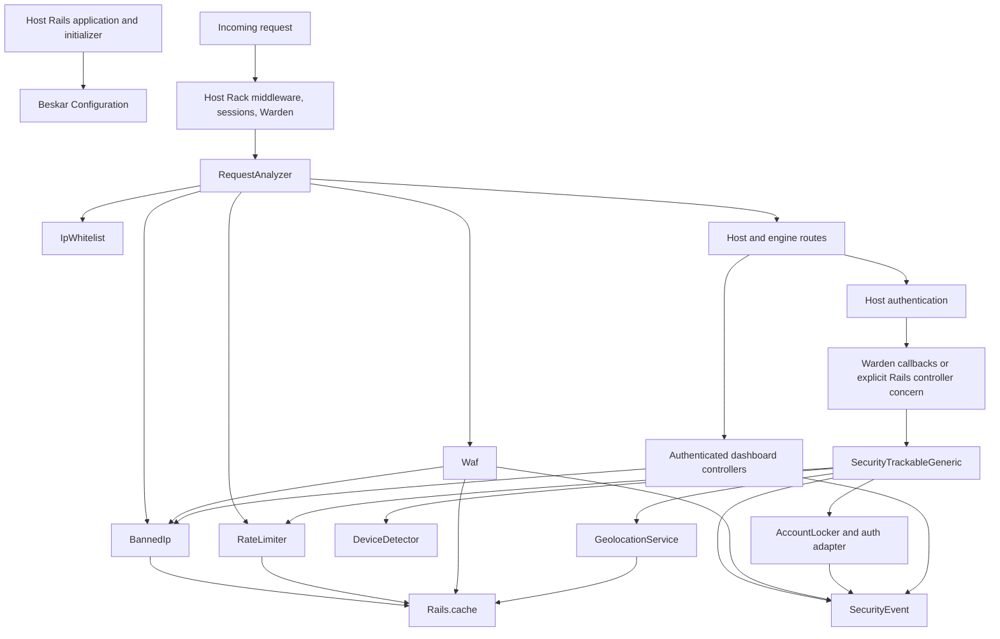

# Beskar: architecture, behavior, and repair map

Historical baseline, preserved from the original review. Its findings and source
references describe the code at review time; see [repair status](repair-status.md)
for subsequent fixes and the [documentation index](../README.md) for current guides.

Reviewed 2026-09-10 against commit `f9f82c9` and the current working tree. Runtime checks used the requested mise default, Ruby **4.0.6**, with Rails **8.0.2.1**, Rack **3.2.1**, and Devise **4.9.4**. The working `Gemfile.lock` changed during the review; its current Minitest version is **6.0.6**. Those dependency changes were preserved.

This is a diagnostic document, not an implementation change or a claim of complete security assurance. It distinguishes reproduced behavior, conclusions from source, and deployment questions still requiring evidence. No application fixes have been applied.

## Assessment

Beskar has a workable structure for a Rails security engine: two small persistent models, an isolated dashboard, a request middleware, and shared authentication concerns with separate adapters. That structure is worth keeping.

The main weakness is the connection between components. A detector may produce a result that no caller enforces; a protection may consume history that the real authentication flow never produces; an audit setting may control an enforcement decision; and the cache can disagree with the database about whether a ban exists. The test suite frequently exercises individual components with hand-built state, which conceals these gaps.

Several advertised capabilities are incomplete. The implemented WAF is a URL-pattern and exception scanner. Device detection is based on user-agent text. There is no implemented JavaScript challenge, honeypot, general SQL injection/XSS inspection, or background security-analysis job.

The initial repair should make existing behavior coherent and testable before expanding detection features.

## Architecture and ownership

| Area | Primary files | Responsibility and important boundaries |
| --- | --- | --- |
| Package/bootstrap | [lib/beskar.rb](../../lib/beskar.rb), [engine.rb](../../lib/beskar/engine.rb), [gemspec](../../beskar.gemspec) | Requires components, installs middleware and global Warden callbacks, preloads bans after initialization. Mounting controls dashboard routes; middleware installation happens independently. |
| Configuration | [configuration.rb](../../lib/beskar/configuration.rb) | Mutable global configuration made of nested hashes. Defaults are instantiated through `Beskar.configure`; there is no comprehensive boot-time validator. |
| Request enforcement | [request_analyzer.rb](../../lib/beskar/middleware/request_analyzer.rb) | Resolves IP; checks whitelist, existing ban, authentication counters, WAF; returns 403/429 or calls the host app. Also catches selected downstream exceptions. |
| Authentication integration | [engine.rb](../../lib/beskar/engine.rb), [security_tracking.rb](../../app/controllers/concerns/beskar/controllers/security_tracking.rb) | Warden success/failure hooks are automatic; Rails-native controllers must call tracking methods explicitly. |
| Shared account analysis | [security_trackable_generic.rb](../../lib/beskar/models/security_trackable_generic.rb) | Builds events, extracts request context, calculates risk, records attempts, consults account history, and initiates locking. This is the most coupled component. |
| Auth adapters | [security_trackable_devise.rb](../../lib/beskar/models/security_trackable_devise.rb), [security_trackable_authenticable.rb](../../lib/beskar/models/security_trackable_authenticable.rb) | Devise helpers versus Rails-native session destruction/password reset. `SecurityTrackable` is a wrapper around the Devise concern. |
| Detection/services | [services](../../lib/beskar/services) | URL/exception patterns, sliding authentication counters, user-agent parsing, geolocation, whitelist parsing, account locking. These mostly access global config/cache directly. |
| Persistence | [security_event.rb](../../app/models/beskar/security_event.rb), [banned_ip.rb](../../app/models/beskar/banned_ip.rb), [migrations](../../db/migrate) | Audit/history and one mutable ban record per IP. Ban model callbacks also maintain cache. |
| Administration | [controllers](../../app/controllers/beskar), [banned_ip_manager.rb](../../app/services/beskar/banned_ip_manager.rb), [views](../../app/views/beskar) | Authentication callback, dashboard aggregates, event search/export, ban creation/update/bulk actions. Server-rendered, with handwritten JavaScript. |
| Installation | [install_generator.rb](../../lib/generators/beskar/install/install_generator.rb), [beskar_tasks.rake](../../lib/tasks/beskar_tasks.rake), [initializer template](../../lib/generators/beskar/install/templates/initializer.rb.tt) | Two separate installation paths with different behavior and stale instructions. |
| Verification | [test](../../test), [test helper](../../test/test_helper.rb), [.github/workflows](../../.github/workflows), [benchmark](../../benchmark) | SQLite dummy app containing both authentication systems; Minitest/FactoryBot/Mocha; duplicate CI workflows; component microbenchmarks. |

The actual dummy middleware stack places Beskar **after Warden**, close to the router. Static/asset middleware and other outer middleware can answer requests before Beskar sees them. Exceptions raised upstream cannot be caught by Beskar. This is application-layer protection, not protection of the whole ingress path.

### Request workflow

1. Build `ActionDispatch::Request` and take `request.ip`.
2. Resolve the memoized IP whitelist.
3. Check `BannedIp.banned?`: cache first, database fallback. A cached `false` is authoritative for five minutes.
4. Check the IP authentication-attempt counter and a separate authentication-failure key. A denied request increments another counter; five denials create/extend a one-hour ban.
5. If WAF is enabled, match the raw `fullpath`, append a violation to cache, compute its cumulative decayed score, create a database event, and possibly create/extend a ban.
6. Apply monitor/whitelist behavior and either respond or call the application.
7. Selected downstream Rails exceptions produce additional WAF events; exceptions are then re-raised for Rails to handle. A path match plus an exception can count twice.

Ordinary page requests do **not** increment the main authentication-attempt counter. But once that counter is over its limit, the middleware can deny **every** request from that IP, including non-authentication pages.

### Authentication workflow

**Devise success:** Warden `after_set_user`, excluding session fetches, calls the user's shared tracker. It persists `login_success`, optionally attempts to queue analysis, records counters, and asks `AccountLocker` to lock. The Warden callback then optionally tries immediate sign-out. A “success” event therefore means credentials/set-user succeeded; it does not necessarily mean Beskar permitted the completed session.

**Devise failure:** Warden `before_failure` resolves a model by camelizing the scope, extracts an email, creates a `login_failure` with `user: nil`, and records IP/global attempts. Warden failures also occur for unauthenticated protected-page access, not just rejected submitted credentials.

**Rails-native authentication:** The host verifies the password, calls `track_authentication_success`, and then creates a session. The tracking concern rescues errors and does not return an enforceable allow/deny decision to the sample controller. Failures use the same anonymous-event path as Devise.

### State and persistence

| State | Storage | Lifetime/invalidation | Consequence |
| --- | --- | --- | --- |
| Security events | `beskar_security_events` | No automatic retention job; linked events are destroyed with their user | This table is simultaneously audit storage, adaptive-trust history, and risk-analysis input. Retention/deletion changes protection behavior. |
| Bans | `beskar_banned_ips` | One unique string IP; rows deleted on unban | Current state is preserved, but administrative history is not append-only. `permanent` and `expires_at` can contradict each other. |
| Effective ban | `beskar:banned_ip:<ip>` | Positive TTL varies by write path; negative TTL five minutes | Cache/database agreement is part of enforcement correctness. |
| IP/account attempts | `beskar:ip_attempts:<ip>`, `beskar:account_attempts:<class>:<id>` | Hash of second timestamps to counts; writes use a hard-coded one-hour TTL plus 60 seconds | Shared cache alone does not make updates atomic; custom long windows can lose history early. |
| Global attempts | `beskar:global_attempts` | Same hash, hard-coded one-minute TTL plus 60 seconds | A single shared key becomes a contention point. Global backoff has a key collision. |
| Backoff | `beskar:ip_backoff:<ip>`, account equivalent | Incremented by limit checks; one-hour TTL | It produces a number, not an enforced deadline. |
| Authentication abuse | `beskar:ip_auth_failures:<ip>` | Read by middleware; never written by production code | This detection branch is disconnected. Tests populate it manually. |
| Rate-limit denials | `beskar:rate_limit_violations:<ip>` | Integer, TTL refreshed to one hour on each write | Not a true “last hour” counter; recurring traffic can keep old violations alive. |
| WAF history | `beskar:waf_violations:<ip>` | Array, configured window (six hours), at most 50 entries | Eviction/restart can erase unbanned attack history; database events do not reconstruct it. |
| Geolocation | `beskar:geolocation:<ip>` | Four hours by default | Cache key omits provider/database version. Mock results can survive a provider change. |
| Whitelist | Service instance variables | Manual `clear_cache!` | Independent from `Rails.cache`; changing config or clearing Rails cache does not refresh it. |

With a process-local cache, workers can disagree about rate limits, WAF history, newly added bans, and unbans. A shared store is an operational prerequisite for consistent deployment, but still does not fix the read/modify/write races.

## Configuration and risk semantics

| Setting | Effective behavior |
| --- | --- |
| `monitor_only` | Defaults to `false` in `Configuration`. The generated initializer writes a literal `true` only if generated in development; generation in production/test writes `false`. It bypasses middleware denials but still persists/enlarges real ban records and does not guard account locking. |
| `waf[:enabled]` | Defaults to `false` in the class and is set to `true` by the initializer template. It does not disable persistent bans or authentication-rate enforcement. |
| `security_tracking[:enabled]` | Disables auth event production and associated new auth-counter writes. It is not a master switch for WAF, existing bans, or preexisting rate-limit state. |
| Per-outcome tracking | Turning off failed-login auditing also turns off its rate-limit accounting. Recording and protection cannot currently be configured independently. |
| `waf[:auto_block]` | Controls WAF-triggered ban creation and threshold denials. Previously persisted bans remain enforceable. |
| IP whitelist | Bypasses the middleware's blocking checks; WAF audit still runs. AccountLocker and public rate-limiter APIs do not apply this policy. |
| Risk-based locking | Off by default; threshold 75; implemented strategy is Devise lockable. `:custom` is a stub. |
| `immediate_signout` | Off by default. Enabling it together with risk locking currently reaches a broken method call in the Warden callback. |
| `auto_unlock_time` | Exposed as configuration and logged, but it does not set Devise's actual `unlock_in` period or schedule an unlock. |
| Geolocation provider | Defaults to generated mock geography in all environments. Real MaxMind operation requires a database file. |
| Authentication models | Scope lists exist, but failure resolution simply camelizes the scope; it does not use `Devise.mappings[scope].to`. |

**Authentication scoring:** successful login starts at 1; user-associated failure starts at 25; anonymous failure starts at 10. User-agent risk contributes up to 50. Two recent *user-associated* failures add 20. Established success patterns scale the score to 30%, capped at 25, before geographic risk is added. Geographic risk is capped at 30. The final result is capped at 100.

The normal failure callbacks do not associate events with the user, and persisted geographic data does not match the geolocation service's input contract. Consequently, in the stock flow the missing failure/travel contributions commonly leave successful-login risk at no more than 61, below the default lock threshold of 75. This is an inference from the scoring paths, not a measured production distribution. Hand-created associated events in tests bypass the problem.

**WAF scoring:** each analysis contributes one score based on its highest severity: low 30, medium 60, high 80, critical 95. Scores decay exponentially with severity-specific half-lives of 15, 45, 120, and 360 minutes. The default block threshold is 150; permanent threshold 500. Its cumulative score is different from the individual event's `risk_score`. WAF duration selection and `BannedIp`'s separate violation-count escalation both modify ban lifetime.

## What is worth preserving

| Strength | Why it helps | Tradeoff to manage |
| --- | --- | --- |
| Isolated Rails engine | Host integration and dashboard reuse are straightforward | Global middleware/callback installation still affects the whole host application |
| Small persistent schema | Easy to inspect, migrate, and operate; unique IP index is useful | Minimal constraints permit contradictory states; event history also drives security decisions |
| Generic concern plus adapters | Provides a reasonable starting boundary for Devise and native auth | Adapter capabilities need explicit contracts; native locking is not implemented |
| Persistent ban plus cache | Fast common path and recovery of committed bans after restarts | Consistency, commit timing, expiry, and multi-process invalidation must be designed together |
| Local geolocation option | No external per-login lookup service required | Database provisioning/updating and provider validation belong in the integration contract |
| WAF decay and bounded history | More nuanced than a permanent increment-only counter; bounded per-IP entries | Scores are uncalibrated, per-IP state is attacker-controlled, and benign traffic can match |
| Deny-by-default dashboard controller | Missing/false authentication results are denied; inherited CSRF protection is enabled | Shipped callback examples contain dangerous edge cases; browser and CSRF behavior need real tests |
| Bound SQL parameters and escaped ERB output | Most ordinary injection/XSS risks are reduced by Rails conventions | JSON filtering, CSV output, raw URL logging, and inline scripts need separate treatment |
| Substantial test inventory | 596 `test` declarations across service/model/controller/integration files provide material to improve | Number and names do not establish end-to-end coverage; the current runner cannot execute them |
| Modest dependency/UI footprint | No separate frontend build is needed for the dashboard | Handwritten JavaScript duplicates framework behaviors and must work with host CSP/navigation |

## Findings and repair priorities

`P1` means prioritize before relying on the affected protection in production. `P2` means a meaningful correctness, operability, or compatibility issue. `P3` means lower-risk cleanup. These are repair priorities, not CVSS scores. **Runtime** means reproduced on Ruby 4.0.6; **Source** means established by reading the implementation; **Deployment** identifies an untested integration assumption.

### F01 — P1 — Account/global rate limits do not govern authentication

**Runtime + Source.** `SecurityTrackableGeneric` lines 51–52 and 121–122 call `check_authentication_attempt` after event creation but discard its result. Middleware lines 133–138 only enforce the IP check. With account and global limits both set to 1 and the IP limit raised, three independent Devise logins succeeded and accessed a protected page (HTTP 200); both limit services reported `allowed: false` afterward.

Failures are always recorded with `user: nil`, so a real user's account counter remains zero during failed-password attempts. Three failures produced three audit events and three IP attempts, but zero user-associated failures and zero account attempts. That also disconnects risk scoring and distributed-account attack detection from actual login failures. Conversely, merely visiting a Devise-protected page without a session produced a `login_failure` with no attempted email and incremented the IP counter, despite no credentials being submitted.

**Repair:** define an admission decision before session creation; count attempts by a normalized, scoped account identifier even before user lookup; consume the decision in each adapter. Distinguish authentication denial from auditing. Regress with multiple IPs attacking one account and with a global budget crossed across unrelated users.

### F02 — P1 — Enabling immediate sign-out breaks successful Devise login

**Runtime.** [engine.rb](../../lib/beskar/engine.rb) line 36 calls `user_was_just_locked?` on the initializer's engine instance, but the helper at line 72 is a class method. A real login with `immediate_signout: true` and risk locking enabled raises `NoMethodError: undefined method 'user_was_just_locked?' for an instance of Beskar::Engine`. A separate low-risk login with threshold 100 reproduced the same error; the account need not actually qualify for locking.

The existing sign-out tests call the class helper or a separate model helper directly; they do not enable this actual callback path. After fixing the receiver, the helper still infers a decision from any lock event in the last ten seconds, rather than this authentication attempt. Disabling/failing lock-event logging can then remove the evidence sign-out needs, and `auth.logout` has no scope argument.

**Repair:** have locking return a structured result tied to the current attempt; make the adapter act on that result. Audit persistence should not be a prerequisite for sign-out. Test the real Warden path with low/high risk, multiple scopes, and logging disabled.

### F03 — P1 — Monitor/whitelist policy does not cover account actions

**Runtime + Source.** [account_locker.rb](../../lib/beskar/services/account_locker.rb) lines 39–83 never checks monitor mode or whitelist. A real tracked Devise success with monitor enabled and a deliberately low threshold locked the account and created `account_locked`.

The middleware's policy is therefore narrower than the global-mode promise. Lowering the threshold to test behavior in monitor mode can change actual accounts. Direct service callers can also obtain rate-limit denials despite monitor/whitelist settings.

**Repair:** centralize which actions monitor and whitelist suppress, apply that policy to every action, and record “would lock” distinctly from “locked.” Preserve necessary audit events. Decide whether trusted IPs should suppress account protection as a product rule, not an accidental implementation difference.

### F04 — P1 — Rails-native locking is not connected to an implemented strategy

**Runtime + Source.** [security_trackable_generic.rb](../../lib/beskar/models/security_trackable_generic.rb) lines 266–270 calls the native adapter only when `AccountLocker` returns true. Its Devise strategy cannot lock `User`; its custom strategy returns false. With threshold 1, a native login recorded `lock_attempted`, kept the existing session, created another session, and accessed a protected page with HTTP 200.

The native session-removal method also compares Rails' Rack session identifier to the database session primary key. The supplied controller tracks before creating the new database session and never branches on a deny result. Even activating the current removal method would not establish a reliable login refusal contract.

**Repair:** define native adapter operations for refusing session creation, revoking sessions, account state, and recovery. Provide an implemented host hook/strategy or clearly limit the advertised capability to event tracking until one exists.

### F05 — P1 — Impossible-travel inputs are incompatible with stored history

**Runtime + Source.** The generic tracker passes JSON-backed hashes with string keys to [geolocation_service.rb](../../lib/beskar/services/geolocation_service.rb) lines 192–205, which reads symbol keys. It also passes `last.created_at.to_i` at generic line 235, although the service expects *elapsed seconds*. Either defect independently defeats impossible-travel detection.

A 60-second trip between two different mock locations returned true with symbol-keyed coordinates; the identical persisted/string-keyed location returned false. Passing an epoch timestamp also returned false. Country comparisons use symbol keys too, so known persisted countries can appear different. The caller compares several old locations against one timestamp, and `.last` has no explicit chronological ordering.

**Repair:** normalize the data contract and pass timestamped location observations. Test actual database round trips and realistic elapsed times, then validate known/unknown/private location behavior before recalibrating thresholds.

### F06 — P1 — Client-IP resolution bypasses Rails' configured proxy interpretation

**Runtime + Deployment.** Middleware and tracking use `request.ip`, while the host's native session code uses `request.remote_ip`. A proxy-chain probe with a public trusted proxy gave `203.0.113.10` to Beskar while Rails' configured resolver returned the actual client `198.51.100.213`.

This can attribute many clients to one proxy, ban that proxy, or apply the whitelist to the wrong address. Exploitability depends on ingress header handling; this review did not inspect a production proxy. Remote-IP calculation is lazy, so the mere presence of `ActionDispatch::RemoteIp` does not guarantee Beskar triggers its spoof checks. See the [Rails configuration guide](https://guides.rubyonrails.org/configuring.html) for the proxy configuration boundary.

**Repair:** resolve and validate a canonical client identity once, using the host's supported trust configuration. Test trusted/untrusted proxy chains, IPv6, conflicting headers, and direct requests.

### F07 — P1 — Cached bans can outlive edits and transaction rollback

**Runtime.** [banned_ip.rb](../../app/models/beskar/banned_ip.rb) lines 15–17 and 172–181 write cache before commit. Updating a ban's IP leaves the old key behind. Updating its expiry into the past does not clear its positive cache entry. Creating a ban inside a rolled-back transaction still leaves the address blocked.

There are several independent cache writers: callbacks, `ban!`, lookup, and startup preload. `ban!` overwrites callback TTL with the requested duration rather than the final record expiry. Bulk permanent updates bypass callbacks; negative entries can remain stale. Startup preload imposes a minimum 60-second positive TTL even on nearly expired bans.

**Repair:** establish one cache synchronization contract after commit, invalidate previous and current identities, derive TTL from committed state, and cover rollback/edit/expiry/bulk operations. Shared-store coherence needs separate multi-worker verification.

### F08 — P1 — Permanent-ban state is contradictory and can stop enforcing

**Runtime.** Calling `ban!(existing_ip, permanent: true)` does not set the existing record's permanent flag or clear its expiry. The cache can nevertheless be written with no expiry. Conversely, `extend_ban!` eventually sets `permanent: true` without clearing an old expiry; `.active` only tests expiry, whereas `active?` honors the permanent flag.

After automatic escalation and time travel beyond the old expiry, the record reported `permanent? == true` and `active? == true`, but disappeared from `.active` and was not blocked after cache loss. The expired cleanup scope can select such a record too.

**Repair:** define and enforce the invariant for permanent versus temporary bans in validation, database constraints where appropriate, query scopes, and transition methods. Test cache loss/restart as part of ban lifecycle tests.

### F09 — P1 — Shared counters are not concurrency-safe

**Runtime + Source.** Rate attempts, backoff counts, middleware-denial counts, and WAF arrays use separate cache reads and writes. A controlled two-thread interleaving through the real rate-counter writer recorded **one attempt for two writes**, using MemoryStore; sharing the store does not make this multi-step operation atomic.

Existing-ban extension also reads/modifies/saves without a lock or atomic increment. New-ban retries only catch a validation error by matching its English message; the database's unique-index race can instead raise `RecordNotUnique`.

**Repair:** choose atomic storage operations for counters and WAF state; define concurrency-safe ban transitions. A generic Rails cache API may not provide all required primitives. Verify on the actual supported shared backend, with parallel callers targeting the same key.

### F10 — P1 — Shipped dashboard authentication examples have unsafe edge cases

**Runtime + Source.** The cookie example in the [initializer template](../../lib/generators/beskar/install/templates/initializer.rb.tt), lines 34–37, compares an absent cookie to an environment secret without requiring that secret to exist. With a missing expected token, anonymous dashboard access returned HTTP 200 because `nil == nil`.

The default controller correctly denies an explicitly false callback (HTTP 404). The problem is the shipped integration recipe. The bearer example similarly lacks a nonempty-secret guard. The generator's `proc { authenticate_admin! }` example can recursively invoke Beskar's own method; its redirect example does not implement the truthy/falsey contract for an authorized user. Authentication helpers that already render/redirect can also collide with the controller's unconditional failure rendering.

Additionally, the missing-auth configuration message interpolates `ENV["BESKAR_ADMIN_TOKEN"]` into a logged example at [application_controller.rb](../../app/controllers/beskar/application_controller.rb) line 67, potentially logging a configured secret. No actual secret was retrieved during this review.

**Repair:** ship executable, tested callback recipes with required-secret checks and safe comparison; avoid recursive names and duplicate renders; remove secret interpolation from diagnostic examples.

### F11 — P1 — Audit output can expose sensitive inputs and unsafe CSV cells

**Runtime + Source.** WAF copies raw `request.fullpath` into matched patterns, cache state, database metadata, and warning logs. A harmless review URL `/search?q=/wp-admin&token=REVIEW_SECRET` retained the entire token-bearing query. These custom writes do not apply Rails parameter filtering. Authentication metadata also retains session identifiers, referrers, and forwarded headers; top-level user agents are not truncated by the detector's nested-field truncation.

CSV export preserved the attacker-controlled user agent `=1+1` as a cell. Spreadsheet applications can interpret such cells as formulas; see [OWASP's CSV injection guidance](https://owasp.org/www-community/attacks/CSV_Injection). This was a text-level export reproduction, not execution inside a spreadsheet.

**Repair:** define a bounded, filtered audit schema at capture time, classify data retention/access, and make exports safe for their intended consumers. Keep sufficient decision evidence without retaining raw secrets.

### F12 — P1 — Failure behavior can turn security plumbing into request outages

**Runtime + Source.** Middleware cache/database access has no general dependency-failure policy. WAF event persistence is rescued, but ban persistence is re-raised. Injecting a ban-storage failure caused even a monitor-only request to raise instead of reaching the app. Devise's direct generic tracking path is not rescued like the native controller concern, so similar faults have different effects by adapter.

The logger's rescue block calls its own `warn` method rather than `Kernel.warn`. A failing logger that also fails warnings recursed to `SystemStackError` in a probe ([logger.rb](../../lib/beskar/logger.rb), lines 34–42).

**Repair:** explicitly decide degraded behavior for audit loss, unavailable enforcement state, and failed account actions. Do not blanket-rescue everything into an allow decision. Keep failure reporting independent of the failed logging backend, and test errors on real request paths.

### F13 — P1 — Verification tooling currently cannot establish a green baseline

**Runtime.** `mise exec -- env PARALLEL_WORKERS=1 bin/rails test` aborted before executing tests: Minitest 6 calls the suite runner with three arguments, whereas Rails 8.0.2.1's `Rails::LineFiltering#run` accepts one or two. The checked-in baseline lock had Minitest 5.25.5; the current working lock selects 6.0.6.

`bundle exec standardrb --format progress` also exited unsuccessfully: the locked RuboCop AST/Prism stack rejects target Ruby 4.0. “No offenses detected” in its trailing text is not a successful lint run; zero files were inspected.

CI only selects Ruby 3.4 and runs in two overlapping workflows. Neither establishes compatibility with the requested Ruby 4.0.6 runtime. The gemspec declares Rails `>= 8.0.0` without a tested upper bound or explicit Ruby requirement.

**Repair:** restore test/lint compatibility on Ruby 4.0.6, agree the supported Rails/Ruby matrix, then consolidate CI around it. Do not treat the runtime probes in this review as a replacement for a passing suite.

### F14 — P2 — Brute-force detection reads nonexistent production state

**Runtime + Source.** Middleware line 154 reads `beskar:ip_auth_failures:<ip>`; no production writer exists. Tests in `middleware_blocking_test.rb` lines 220 and 249 inject it directly. The branch also counts timestamp buckets instead of summed attempts, so many failures in one second would be counted as one even if a writer were added.

IP attempt limiting still operates through a different key; the finding does not mean all brute-force resistance is absent. Devise's own Lockable behavior is another independent layer.

**Repair:** use the same authoritative attempt data and window semantics as F01/F09; remove the disconnected parallel representation.

### F15 — P2 — Backoff is side-effectful reporting, not a delay contract

**Runtime + Source.** Two checks of an already-limited IP returned retries of 60 then 300 seconds without another authentication attempt. The request became allowed two seconds later when a configured one-second window elapsed; no backoff deadline was enforced. Middleware always responds `Retry-After: 3600` instead of the service result. `most_restrictive_result` returns the first denied tier, not the maximum delay.

Enabling the exposed global `exponential_backoff` option raises `NoMethodError` because substituting `_attempts:` does not change the key `beskar:global_attempts`: its attempt hash is read as the backoff integer. Recording TTLs also ignore custom windows, and the public reset method does not clear middleware-denial state, global attempts, WAF history, or bans.

**Repair:** separate pure inspection, atomic accounting, and actual retry eligibility. Document reset scope and make returned headers consistent with enforced timing.

### F16 — P2 — WAF pattern scope causes false positives and coverage gaps

**Runtime + Source.** The unanchored patterns match the entire raw URL, including query values. `/.well-known/openid-configuration` was classified as a debug scan; a search query containing `/wp-admin` was classified as WordPress probing. `/%2e%2e%2fprivate` did not match the traversal patterns. URL normalization upstream will influence particular encodings, so this is a local matcher result, not a claim of exploitation of a host vulnerability.

Every uncaught `RecordNotFound`/`UnknownFormat` in scope is treated as suspicious by default. Exclusions only address `RecordNotFound`; they do not provide a general route/method/category policy. The first critical match remains below the default cumulative threshold, so this system is not a guarantee against one-shot exploitation. There is no request-body or general SQLi/XSS inspection despite the gem description.

**Repair:** define the supported threat model, canonicalized inputs, per-route exclusions, and whether certain confirmed threats require immediate decisions. Build a benign-traffic corpus alongside attack cases; remove unsupported marketing claims.

### F17 — P2 — Risk explanations and adaptive trust are not well-founded

**Runtime + Source.** Device detection emits `bot`, while lock-reason classification looks for `bot_signature` or `suspicious`. Geolocation risk returns an integer, but lock-reason classification expects `impossible_travel`, `country_change`, and `high_risk_country` flags that ordinary lookup does not produce. Emergency-reset queries expect context at the metadata root, while lock events put it under `additional_context`.

Trust is based on repeated IP address use, not a verified device or user-confirmed recovery. `account_locked` and `lock_attempted` are treated like an unlock for parts of adaptive learning. Credential-success events are persisted before the enforcement result. A model-level probe showed that such history can mark an IP established; it does not establish that an attacker can authenticate an already locked Devise account through the real login endpoint.

Other scoring defects: `hour.between?(22, 6)` is false for every hour, and `match?` does not set `$1`, so a modern Chrome 120 user agent received the old-browser risk increment. `geographic_anomaly_detected?` is a placeholder returning false. User-agent parsing is spoofable metadata, not proof of device identity or bot legitimacy.

**Repair:** return a score with explicit normalized factors and evidence. Separate credential success, admitted session, confirmed recovery, and trusted context. Calibrate only after the missing history and geography contracts are repaired.

### F18 — P2 — Lock recovery settings are partly placeholders

**Source.** `auto_unlock_time` only causes `locked_at` to be set to the current time; Devise actually consults its own `unlock_in`. Locking calls Devise with `send_instructions: false`, while Beskar's `notify_user` only logs intent. Native emergency-reset notifications also only log. `require_manual_unlock` is never consumed.

An emergency password reset can change the password before later event persistence fails, yet the broad rescue can describe the operation as a failed reset. The action is not transactional with its audit/recovery workflow.

**Repair:** make recovery and notifications real adapter capabilities with truthful configuration. Test user recovery, delivery failures, partial persistence failures, and session revocation as part of the same flow.

### F19 — P2 — Monitor-to-enforcement transition changes live ban state

**Source; behavior partly intentional and documented.** Monitor mode uses the real ban table and repeatedly extends bans while traffic continues. Ban records themselves do not identify simulated versus enforced origin. Disabling monitor mode immediately enforces surviving bans, potentially with durations accumulated under observation conditions that differ from active blocking (where requests would have exited early).

WAF event `would_be_blocked` is only a score comparison; it ignores whitelist and `auto_block`. Monitor impact statistics can therefore count requests that policy would allow. Authentication/rate-limit events do not all carry equivalent mode/decision metadata.

**Repair:** model observed decisions separately from enforced ban state, or define and expose an explicit activation policy. Report final policy outcomes rather than just threshold crossings.

### F20 — P2 — Installation paths and defaults disagree

**Runtime + Source.** The generator calculates its migration source one directory above the engine: `/home/mlitwiniuk/Sites/r8/db/migrate`, which does not exist, although the engine has two migrations. It silently skips copies and prints success. Its custom destination builder also prefixes the entire path (`<timestamp>_db/migrate/...`) instead of the migration basename.

The rake task is a separate implementation. Its instructions reference nonexistent `Beskar::SecurityTrackable` and the removed nested `waf[:monitor_only]`. The generator advertises a nonexistent `beskar:indexes` generator. Generator tests emphasize template content and mounting, not successful install/migrate/boot in a fresh host.

The template's monitor value is fixed at generation time, so the README's safe monitor default depends on where the initializer was generated, not where it runs.

**Repair:** one installation implementation and source of defaults, tested in a fresh host with Devise absent/present, followed by migration and request smoke checks. Use correct, executable next-step instructions.

### F21 — P2 — Missing capabilities are exposed as though available

**Source.** `SecurityAnalysisJob` is never defined; `auto_analyze_patterns` therefore queues nothing. Only empty base job/mailer classes exist. API v1 routes are declared in [routes.rb](../../config/routes.rb) lines 27–41, but corresponding controllers do not exist. Generic custom locking, IP2Location lookup, and notification methods are placeholders. The Devise concern checks for a class-level `after_database_authentication` registration API, but Devise defines an instance method hook; actual success tracking comes from Warden.

**Repair:** explicitly classify implemented features, host extension points, and plans. Remove nonfunctional public routes and configuration promises or implement them with contract tests.

### F22 — P2 — Database portability and growing history are unverified

**Source + Deployment.** `SecurityEvent.metadata` is a JSON column, but the email filter issues `metadata LIKE ?` without a text cast; that is not valid for PostgreSQL's JSON type. The separate general-search path explicitly casts for PostgreSQL, revealing the inconsistency. Native reset queries use adapter-specific JSON extraction; the suite only configures SQLite.

Auth scoring repeatedly queries and loads event history synchronously. One warm, established-login probe performed six noncached SELECTs plus the event write; other branches add more. The principal user/type/event/time queries lack a matching composite index. Dashboard aggregates scan overlapping ranges separately. Leading-wildcard search is expensive at scale, JSON export loads the whole result, and CSV generation accumulates the complete output in memory even though records are fetched in batches.

**Repair:** name supported adapters and exercise them; centralize adapter-sensitive filtering; measure realistic event volumes with query plans; add retention, appropriate indexes, bounded exports, and background work where justified. Do not move final admission decisions to delayed jobs.

### F23 — P2 — Audit history is mutable and coupled to user lifetime

**Runtime + Source.** Deleting a user destroys its linked security events via `dependent: :destroy`. Unban destroys the ban row, and administrative changes are not recorded with actor, previous state, and reason in an immutable action history. Failed-login events with no user association have a different deletion lifetime from successful events.

This is a product/data-retention decision, not automatically a requirement to keep every personal field forever. It currently undermines the description of a comprehensive audit trail and makes incident reconstruction harder.

**Repair:** define audit retention/anonymization separately from live user and ban state, and record administrative actions with actor and request correlation.

### F24 — P2 — Runtime configuration can be stale or invalid

**Runtime + Source.** Removing an IP from `configuration.ip_whitelist` left it whitelisted until the service cache was explicitly reset. The README does document that reset, but generic config replacement/test resets do not perform it. Geolocation caches omit provider identity, and the singleton reader is not automatically refreshed on a path change.

Nested hash replacement can drop required keys; unknown/deprecated keys are silently accepted. Thresholds, periods, durations, and severity half-lives are not validated. Model auto-detection depends on already loaded descendants; scope-to-class conversion does not support arbitrary Devise mappings. There is no declared startup validation of cache capabilities, locking strategy, or real-versus-mock geolocation.

**Repair:** validate configuration once, expose effective configuration, and make dynamic change semantics explicit. Prefer immutable runtime config if live reconfiguration is not a supported feature.

### F25 — P2 — Rack response contract is violated

**Runtime.** Beskar's direct 403/429 responses contain title-cased header names. Wrapping the middleware in `Rack::Lint` produced `uppercase character in header name: Content-Type`. Rack 3 requires lowercase response header names; see the [Rack specification](https://rack.github.io/rack/3.2/SPEC_rdoc.html). Current integration tests assert the old casing directly.

**Repair:** return Rack-compatible headers, correct retry timing, and appropriate representations for API clients. Add Rack contract validation around direct middleware responses.

### F26 — P2/P3 — Dashboard semantics and host integration need cleanup

**Source; browser behavior not exercised.** Risk labels disagree: models define high at 70 and critical at 90; dashboard/filter boundaries use 61 and 86; badges classify 30 differently from filters. Ban detail “total events” is counted on a relation limited to 20. User displays/JSON export generally assume `email`, while the native sample uses `email_address`.

Some inline scripts lack the nonce used by the layout's script helper and rely on `DOMContentLoaded`; strict host CSP or Turbo navigation can affect them. Datetime helpers convert values to UTC ISO text and put them in local datetime inputs, which can shift intended expiry. This needs browser/timezone validation. Handwritten method-link submission duplicates framework behavior. No browser system tests were found.

**Repair:** unify risk definitions and user presentation; distinguish totals from recent samples; test ban forms, CSRF, expiry timezone, CSP, and host navigation behavior in a real browser.

## Why existing tests miss important defects

These are specific evidence gaps, not a dismissal of the suite:

- `test/integration/warden_signout_test.rb` tests the helper as a class method but leaves `immediate_signout` at its default false; the real callback's receiver error is missed.
- `test/integration/middleware_blocking_test.rb` writes the nonexistent authentication-failure cache state by hand.
- `test/integration/devise_rate_limiting_test.rb` calls a test “distributed rate limiting” while asserting that each IP stays allowed, without asserting a denied account decision.
- `test/integration/rails_auth_security_test.rb` calls a test “high risk login triggers account locking,” but its final assertion is only that an event exists. Emergency reset is tested by manually creating metadata and invoking methods.
- Factories usually associate failure events with a user, while real failure callbacks do not. That difference supplies risk-scoring inputs absent from production paths.
- Several concurrency checks are sequential requests or different-IP operations. They do not exercise competing writes to one security key.
- Cache/provider failure tests are commented out; MaxMind tests skip without a database; the background-job test skips because the job does not exist.
- The shared test helper resets configuration and Rails cache, but not all memoized service state. The IP helper maps hashes into only 200 buckets and is not guaranteed unique. Factory risk values are randomized.
- CSRF protection is globally disabled in the test environment. Request tests do not establish that the dashboard's browser mutation flows work with forgery protection enabled.
- Generator tests verify text references to documentation even when the referenced files/features do not exist.

Meaningful regression tests should start at the caller boundary, create history through real authentication attempts where possible, and assert the final HTTP/session/account/cache state. Component tests remain useful for algorithms once their input/output contracts agree.

## Documentation drift

| Claim or example | Actual implementation |
| --- | --- |
| README/gemspec: advanced bot challenges and honeypots | User-agent regexes; no challenge/honeypot implementation |
| Gemspec: WAF blocks SQLi and XSS | No general SQLi/XSS payload inspection |
| Project docs: background analysis and graceful failure | Undefined analysis job; cache/DB faults can escape; logger fallback can recurse |
| Global monitor-only mode suppresses all blocking | Middleware honors it; account actions do not |
| Monitor docs and older README sections use `block_threshold` | Active WAF uses `score_threshold`; old keys are silently ignored |
| `GeolocationService.lookup`, `IpWhitelist.add/remove`, `calculate_authentication_risk` | These documented methods are absent; actual APIs differ |
| `Beskar::SecurityTrackable`, `:failed`, `login_failed` examples | Actual concern is under `Beskar::Models`; expected outcome is `:failure`; event is `login_failure` |
| Auto-unlock period and notifications | Devise controls unlock timing; Beskar notifications are log-only |
| Database-agnostic, real-time dashboard | Adapter-specific queries; ordinary server-rendered dashboard without polling/push |
| Missing configuration returns 401/helpful examples to browser | Controller returns 404 and logs examples |
| Links to `BREAKING_CHANGES.md`, `DASHBOARD.md`, `WAF_CONFIGURATION_PROFILES.md` | Files are absent in this checkout |
| Documentation release date/version narrative | Version is 0.1.0; project docs mention a 2024 release while changelog is Unreleased and migrations are dated 2025 |
| README performance claims include O(1) rate check | The counter is read and filtered/summed over timestamp buckets; benchmarks do not include full detection/persistence/admission cost |

The README contains both newer score-based guidance and older count-based guidance. It should be reconciled as a whole. Demos also reference the old User email schema and obsolete WAF keys; they are not reliable smoke checks.

## Suggested repair sequence

| Step | Scope | Completion evidence |
| --- | --- | --- |
| 1. Establish Ruby 4.0.6 baseline | Compatible test runner/linter, supported dependency matrix, one CI workflow; retain current behavior initially | Full tests and lint execute on Ruby 4.0.6; exact baseline failures are recorded |
| 2. Close immediate safety/correctness holes | Warden receiver crash, global monitor policy, unsafe auth examples, secret logging, logger recursion, Rack headers | Real auth/dashboard requests and injected failures reproduce the old issue and verify the corrected behavior |
| 3. Make bans internally consistent | Permanent/expiry invariant; committed cache synchronization; edit/unban/rollback behavior; concurrency | Transition tests include time passage, restart/cache loss, same-IP parallel changes, multiple workers |
| 4. Define authentication admission | Canonical account/IP identity, pre-session decision, failure association/accounting, account/global limits, retry/reset semantics | Distributed attempts hit account budget; unrelated attempts hit global budget; denied logins cannot create usable sessions |
| 5. Repair risk data and adapters | Persisted geography/time contract, factor evidence, native lock/recovery, explicit trust establishment | Database-roundtrip travel tests; real Devise/native admission and recovery tests; score explanations match inputs |
| 6. Bound and harden detection/audit | WAF threat scope, benign corpus, input filtering, atomic state, retention, safe exports, admin audit | No secrets in emitted records; expected benign paths allowed; concurrency, volume, adapter, and export checks |
| 7. Reconcile installation/docs/UI | Single tested install path, effective defaults, remove unsupported routes/promises, browser behavior | Fresh host install/migrate/boot succeeds; documented examples execute; actual browser forms work |

Steps 2 and 3 can be split into small independent fixes once step 1 provides a reliable baseline. Step 4's identity/decision contract should precede substantial risk-engine refactoring. A broad rewrite is not necessary to start; fixing the observable contracts will reveal where deeper changes are justified.

The target direction is a small explicit pipeline: **capture normalized context → atomically account for the attempt → assess factors → decide under policy → act through an auth adapter → record the outcome**. This is a proposed design direction, not code already present. Audit storage and asynchronous analysis should observe decisions rather than implicitly determine whether an action succeeded.

## Verification record and remaining questions

Executed directly from the project on mise default Ruby 4.0.6:

- `bundle check`: dependencies satisfied after the working lockfile/dependency setup changed during the review.
- `mise exec -- env PARALLEL_WORKERS=1 bin/rails test`: runner error before tests; no passing-suite claim.
- `bundle exec standardrb --format progress`: Ruby 4.0 parser/tooling error; no clean-lint claim.
- `mise exec -- bin/rails middleware`: actual dummy middleware placement inspected.
- `mise exec -- env RAILS_ENV=test bundle exec rake app:zeitwerk:check`: eager-loading check passed; the dummy app's mailer-preview directory is not included in eager loading. Engine tasks use the `app:` namespace; the initial unprefixed command was unavailable.
- Ruby 4.0.6 compiled all 33 Ruby source files under `lib`, `app`, `config`, and `db` without syntax errors. All local document links resolve. This is a syntax/reference check, not behavioral verification.
- `mise exec -- bin/rails runner -e test tmp/review/probes.rb`: focused probes through real services/models and several actual HTTP/session workflows. Each probe used the test database inside a rolled-back transaction and process-local cache; fault injections were local to the diagnostic process. Probe exceptions are reported deliberately as findings, not swallowed as successful tests.

The diagnostic script is in the ignored `tmp/review` directory. It is review evidence, not a committed regression suite. Initial isolated dependency setup under `/tmp` was abandoned once the project bundle became available; the final runtime checks did not use a different Ruby or temporary dependency manifest.

Still to establish before making production claims:

- Actual production proxy/CDN header handling, canonical IP expectations, and whether shared egress IPs are common.
- Production cache backend/topology, eviction and outage behavior, request rates, and event-history size.
- Supported host Rails/database/auth combinations, custom Devise scope mappings, API-only hosts, and reload behavior.
- Desired policy for successful-login counts, account/global budgets, whitelist scope, monitor activation, and degraded enforcement.
- MaxMind database behavior and update lifecycle; no real database was available for end-to-end geography validation.
- Browser behavior under actual CSP, Turbo, enabled CSRF, and Europe/Warsaw/local datetime input handling.
- An appropriate retention/anonymization policy and the recovery experience after an automatic lock/reset.

The findings above are sufficient to start targeted repairs. A passing compatibility matrix and deployment-level verification remain necessary to establish broader confidence.
